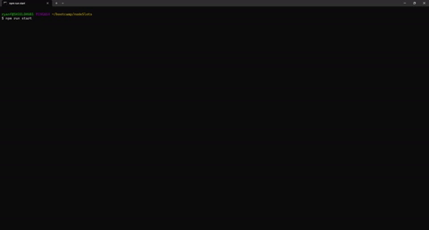

<a id="badges"></a>
[](https://opensource.org/licenses/MIT)

# Ryan's Node Slots


## Description

A simple node game to simulate a classic slot machine. Each symbol is a letter of the name RYAN in honor of it's creator!

#### Good Luck!

## Table of Contents

1. [Usage](#usage)
1. [Installation Code](#installation)
1. [Screenshots](#screenshot)
1. [License](#license)
1. [Links](#links)
1. [Questions](#support)

---

<a id="usage"></a>

## Usage

Download and Clone the repo. Then type the following command:

<a id="installation"></a>

```
npm i
```

_then_

```
npm run start
```

Follow the prompts and _Good Luck!_

---

<a id="screenshot"></a>

## Screenshots

#### HTML Landing Page


#### Gif Walkthrough



---

<a id="license"></a>

## License

[MIT](https://opensource.org/licenses/MIT)

<a id="links"></a>

## Links

<div align="center">

### [Repo Link](https://github.com/8BitGinger/nodeslots)

### [Landing Page](https://8bitginger.github.io/nodeslots/)

</div>

---

<a id="support"></a>

## Questions

Reach out for Questions or Support here:

### Email:

[Send me an Email!](mailto:ryan.fann@gmail.com)

#### GitHub Username:

[8BitGinger](https://github.com/8BitGinger)
